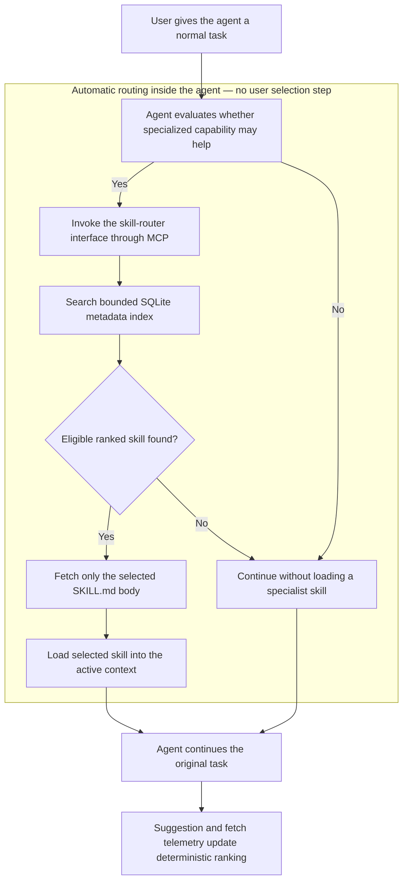

# Torafirma Skill Router

> A local-first, single-binary auto-router for discovering and loading large agent skill libraries without flooding the model context.


> **Automatic routing — no user interaction required:** once connected to an agent through MCP or the included interface skill, the agent invokes Skill Router when a task may benefit from specialized capability, searches the local index, selects and fetches the best-matching `SKILL.md`, and continues the task. The user does not browse the library, run searches, or choose a skill manually.

Skill Router keeps one small interface skill in context and leaves the full skill library on disk. It indexes only metadata in SQLite. During normal agent use, the routing loop happens automatically: intent is converted into a bounded search, a ranked skill is selected, and only that skill's full body is loaded into context.

## One executable, four operating modes

The same `skillrouter.exe` contains the router, interactive shell, CLI, HTTP API, and MCP server. All modes use the same SQLite index, lifecycle state, deterministic ranking, and telemetry.

| Mode | Start command | Intended use | User interaction |
|---|---|---|---|
| **Automatic agent routing (MCP)** | `skillrouter.exe mcp --db .\skill_index.db` | An MCP-capable agent searches, selects, and fetches skills while completing the user's normal task | **None for routing:** the user only states the task |
| **Interactive live shell** | `skillrouter.exe` | Human-operated REPL with live skill-state counts, telemetry, recent events, search, fetch, and library administration | Direct interactive use |
| **Command-line interface** | `skillrouter.exe <command>` | Scripts, CI, diagnostics, smoke tests, indexing, and administration | Direct or automated |
| **Loopback HTTP API** | `skillrouter.exe serve --db .\skill_index.db --port 8090` | Trusted local tools and custom integrations | Determined by the calling application |

Running `skillrouter.exe` with **no arguments** opens the interactive shell. Running `skillrouter.exe --help` prints the scripting and subcommand reference.

## Why it exists

Large agent installations can contain hundreds or thousands of specialized skills. Injecting every skill description and body into every prompt is slow, expensive, and noisy. Skill Router reverses that model:

1. The user gives the agent a normal task — no routing command or skill name is required.
2. The agent invokes the small `skill-router` interface automatically when specialized capability may help.
3. Skill Router searches indexed metadata by natural-language intent.
4. The agent selects a ranked candidate and fetches only that skill body.
5. The agent continues the original task with the selected skill in context.
6. Transparent usage telemetry improves deterministic ranking over time.

Search output stays bounded by `--top`; it does not grow with the size of the library.

## Highlights

- Automatic intent-to-skill routing with no user selection step
- Interactive live shell by launching `skillrouter.exe` with no arguments
- One portable Windows x64 executable containing every interface
- Local-first operation with no remote service dependency
- SQLite FTS5 full-text search with Porter stemming
- Exact, fuzzy, FTS, and hybrid ranking modes
- CLI, interactive shell, loopback HTTP, and MCP stdio interfaces
- Explicit skill lifecycle states and drift detection
- Prepared SQLite statements and bounded query/file inputs
- Deterministic SHA-256 release manifest
- MIT licensed source
- Reproducible MSVC packaging script
- 47 automated C++ tests

## Windows release

[Download Skill Router 1.0.0 for Windows x64](releases/skill-router-windows-x64-1.0.0.zip)

ZIP SHA-256:

```text
FBB8925A621A22BE13EDE6B09BAD9CA0B90DD968B71CC79AB30DF2849338865F
```

The executable is currently unsigned. Verify the ZIP digest before running it.

## Quick start

Extract the archive into a writable directory and add skills beneath `skill_library\`. Each skill directory needs a `SKILL.md` containing `name` and `description` frontmatter.

Index the library once:

```powershell
powershell -ExecutionPolicy Bypass -File .\index-skills.ps1
```

### Option A: automatic agent routing

Connect the MCP server to the agent and keep only the included `skill-router` interface skill in the agent's always-loaded context. From that point, routing is automatic from the user's perspective: the user asks for the underlying task, and the agent performs search, selection, and fetch internally.

```powershell
.\skillrouter.exe mcp --db .\skill_index.db
```

### Option B: interactive shell

Launch the executable with no arguments:

```powershell
.\skillrouter.exe
```

This opens an interactive REPL with a live status and event dashboard. It shows skills by lifecycle state, usage telemetry, and the recent search/fetch event stream while exposing search, fetch, indexing, statistics, graveyard, and administrative operations from one session.

### Option C: CLI and automation

The same executable exposes individual commands for scripts, CI, diagnostics, and smoke tests:

```powershell
.\skillrouter.exe search "windows cpp build" --top 5 --json
.\skillrouter.exe fetch skill-router
.\skillrouter.exe stats
```

## Automatic routing flow



There is no user-facing skill browser or per-task selection prompt in the normal automatic-routing path. Search and fetch are internal agent operations exposed through MCP. The interactive shell, CLI, and HTTP API remain available for direct use, integration, administration, and observability.

## Interactive shell

Run the executable without a subcommand:

```powershell
.\skillrouter.exe
```

The live shell provides:

- an interactive search-and-fetch workflow;
- skill counts grouped by lifecycle state;
- search, suggestion, fetch, and graveyard telemetry;
- a tail of recent search/fetch events refreshed at each prompt;
- library indexing and administrative commands without restarting the process.

Use `skillrouter.exe --help` when command-oriented scripting output is preferred.

## Search modes

```powershell
.\skillrouter.exe search "authentication" --mode hybrid
.\skillrouter.exe search "authentication" --mode exact
.\skillrouter.exe search "authentication" --mode fts
.\skillrouter.exe search "authentcation" --mode fuzzy
```

Hybrid mode is the default. Exact matches remain dominant while FTS stemming and bounded fuzzy matching improve recall.

## MCP integration

Skill Router can run as a newline-delimited JSON-RPC MCP server over stdio:

```powershell
.\skillrouter.exe mcp --db .\skill_index.db
```

It exposes search, fetch, statistics, graveyard telemetry, and `skill://` resources. In an agent integration, search and fetch are tool calls made internally by the agent; they are not steps the user must perform. See the [integration manual](skill-router/INTEGRATION_MANUAL.md) for the complete protocol reference.

## HTTP interface

The optional HTTP interface binds to IPv4 loopback only:

```powershell
.\skillrouter.exe serve --db .\skill_index.db --port 8090
```

Available endpoints include `/health`, `/stats`, `/graveyard`, `/search`, and `/fetch`.

The HTTP interface is intended for trusted local development. It does not provide authentication, so do not expose or forward the port and do not use it with confidential skill libraries on a shared machine.

## Build from source

Requirements:

- Windows x64
- Visual Studio 2022 C++ Build Tools
- PowerShell 5.1 or later

> **Note:** The requirements above are for the provided MSVC build path used to produce the official Windows x64 release. The source itself (`main.cpp`, `skill_library.hpp`, `mcp_server.hpp`) has no Windows-specific dependencies and can be built for other platforms (e.g. Linux, macOS) with an appropriate C++20 toolchain and your own build script; only `build_windows_msvc.bat` and `package-windows.ps1` are Windows-specific.

Build and test from a Visual Studio x64 Developer Command Prompt:

```powershell
cd .\skill-router
.\build_windows_msvc.bat
.\build\test_library.exe
```

Create a clean release:

```powershell
.\package-windows.ps1
```

The packager initializes the Visual Studio toolchain, builds SQLite with FTS5, runs all tests, stages an allowlisted payload, writes `SHA256SUMS.txt`, and creates a versioned ZIP under `dist\`.

## Repository layout

```text
.
|-- README.md
|-- LICENSE
|-- releases/
|   |-- SHA256SUMS.txt
|   `-- skill-router-windows-x64-1.0.0.zip
`-- skill-router/
    |-- main.cpp
    |-- skill_library.hpp
    |-- mcp_server.hpp
    |-- test_library.cpp
    |-- third_party/
    |-- skills/skill_router/
    |-- build_windows_msvc.bat
    |-- package-windows.ps1
    |-- index-skills.ps1
    `-- INTEGRATION_MANUAL.md
```

## Security posture

- The release contains no private skill library, generated database, backup, object file, debug symbol, credential, or machine-specific user path.
- SQLite is vendored at version 3.53.4 and compiled with FTS5.
- SQL values are passed through prepared statements.
- The Windows binary enables ASLR, DEP/NX, and high-entropy virtual addresses.
- Network serving is opt-in and loopback-only.
- MCP uses stdio and opens no network listener.
- Skill bodies are data, not executable code, but downstream agents must still treat third-party skill instructions as untrusted.
- Database files and indexed skill directories should come from trusted sources.
- The binary is not Authenticode-signed; use the published SHA-256 digest.

## Documentation

- [Skill Router README](skill-router/README.md)
- [Windows release guide](skill-router/WINDOWS_README.md)
- [Complete integration manual](skill-router/INTEGRATION_MANUAL.md)
- [Interface skill](skill-router/skills/skill_router/SKILL.md)

## License

MIT License. Copyright (c) 2026 Thomas Helm.

Created by Thomas Helm as part of Torafirma Systems.