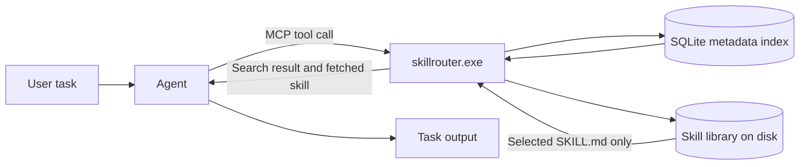
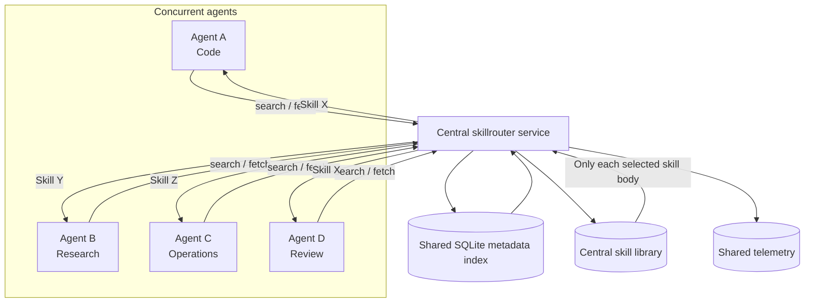
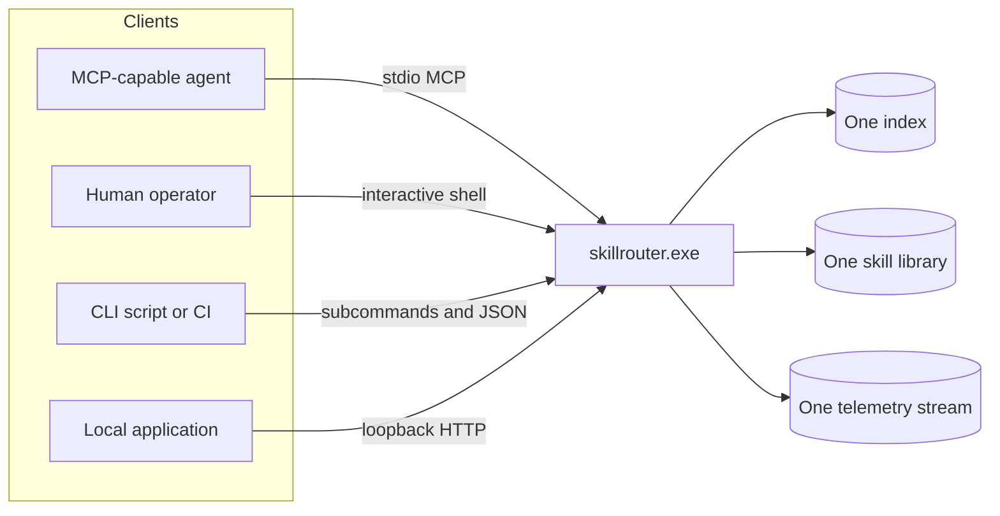
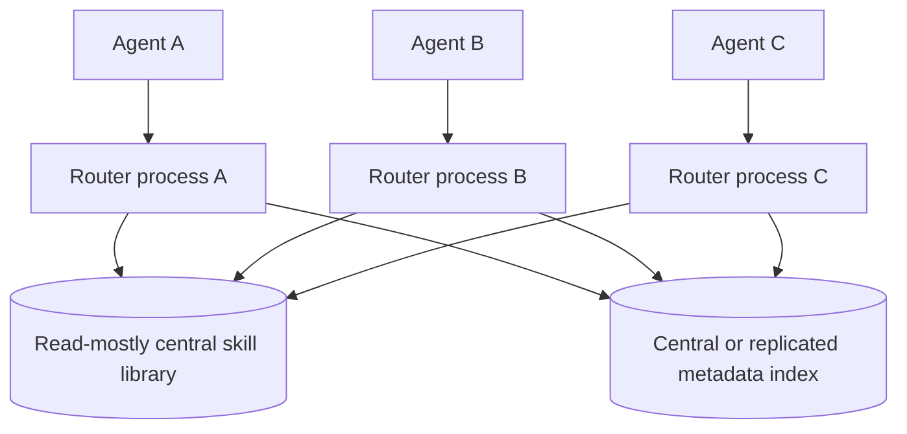
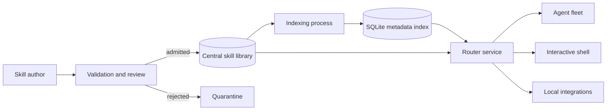
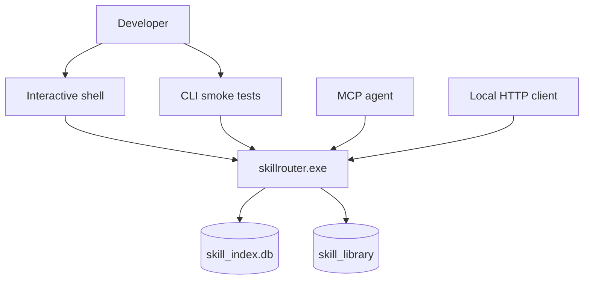

# Skill Router Integration Patterns

This document shows how the same `skillrouter.exe` can serve individual agents, multiple concurrent agents, human operators, scripts, and local services from one centralized skill library.

The key property is separation of concerns:

- skill bodies remain on disk;
- only compact metadata is indexed;
- each agent searches and fetches only the skill it needs;
- agents do not load or mutate one another's active context;
- shared ranking telemetry is centralized and auditable.

## 1. Single-agent automatic routing

The user states the underlying task. The agent decides whether specialist capability may help, invokes the router internally, loads one selected skill, and continues without exposing a manual skill-selection step.

## 2. Centralized library serving multiple agents

Multiple agents can use one governed library simultaneously. Each receives only its selected `SKILL.md`; no agent is required to ingest the complete catalogue, and one agent's active skill context is not injected into another agent's context.

Concurrency concerns are concentrated in the shared storage and transport layer rather than in prompt composition. Integrators should still use normal filesystem and process-isolation controls when agents may modify library files.

## 3. One library, multiple transport interfaces

The MCP server, interactive shell, command-line interface, and loopback HTTP API are different front ends over the same routing engine and lifecycle state.

## 4. Per-agent process isolation with a shared library

Use one router process per agent when process-level fault isolation is more important than maintaining one long-lived service. The skill library should normally be treated as read-only during agent execution; indexing and library administration can be assigned to a separate operator process.

## 5. Central service with governed publication

This pattern separates skill publication from skill consumption. New or modified skills pass validation before entering the active library, reducing the chance that one agent publishes malformed or unsafe instructions directly into the shared capability surface.

## 6. Mixed local development pattern

This is the simplest development setup: one executable and one library are exercised through every supported interface, making it easier to verify that ranking, lifecycle state, and telemetry behave consistently.

## Operational guidance

| Concern | Recommended pattern |
|---|---|
| Lowest integration complexity | One MCP router process per agent host |
| Centralized capability governance | One shared read-mostly library with a controlled publication path |
| Strong process isolation | Separate router process per agent |
| Shared telemetry and ranking | One central service or a coordinated shared database |
| Human inspection and administration | Interactive shell |
| CI, validation, and scripted maintenance | CLI with JSON output |
| Custom local tooling | Loopback HTTP API |

## Conflict model

Skill Router reduces context-level conflict because skills are selected and loaded on demand instead of placing the entire catalogue into every model context. It does not claim to eliminate all distributed-systems conflicts.

The main remaining conflict surfaces are conventional and controllable:

- concurrent writes to skill files;
- concurrent administrative lifecycle changes;
- database write contention under unusually high process concurrency;
- different agents selecting different valid skills for the same ambiguous intent;
- downstream conflicts caused by the skills themselves.

Treat the active skill library as read-mostly, centralize publication and lifecycle administration, and use separate working directories or process boundaries where agents may modify files.
